### ESP8266 아두이노 개발환경 설정

---


아두이노 통합개발 환경(Arduino IDE)을 실행한다.

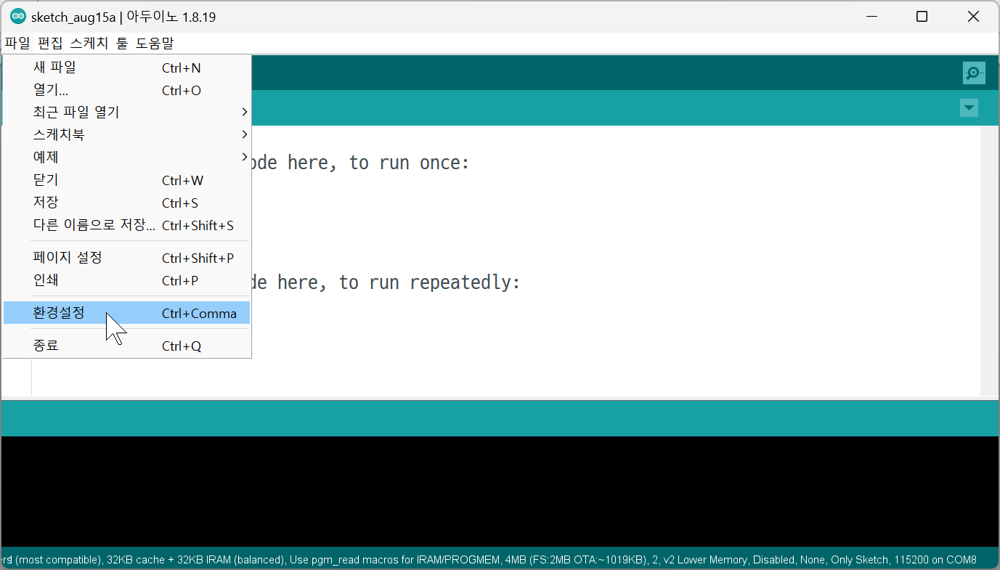

파일 메뉴의 환경설정을 연다.

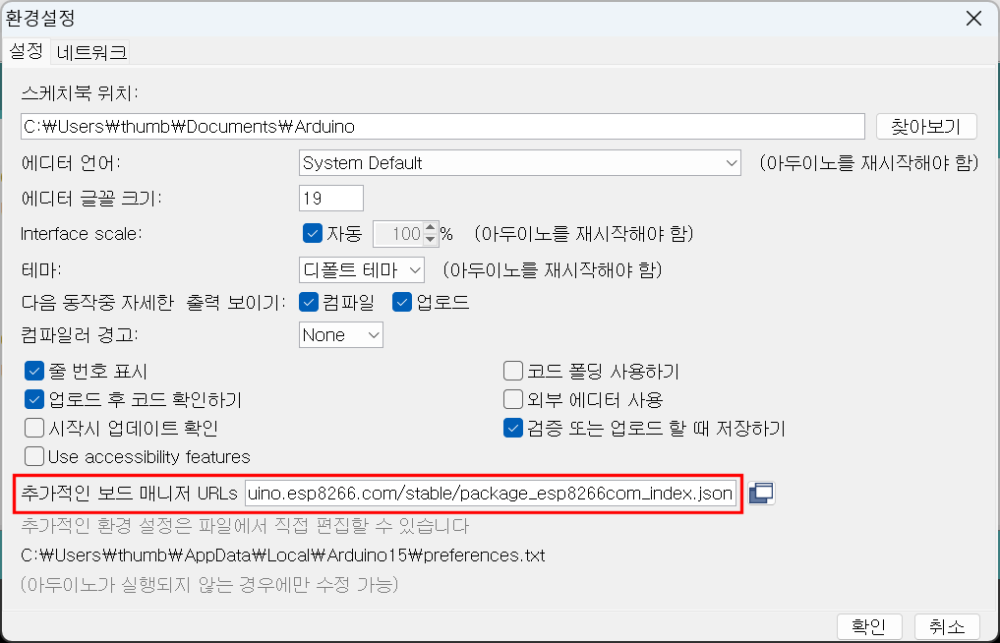

추가적인 보드 매니저 URLs 항목에 다음 URL을 입력 후, 확인 버튼을 클릭한다.

```
http://arduino.esp8266.com/stable/package_esp8266com_index.json
```


툴 메뉴의 보드 항목의 보드 매니저... 를 연다.

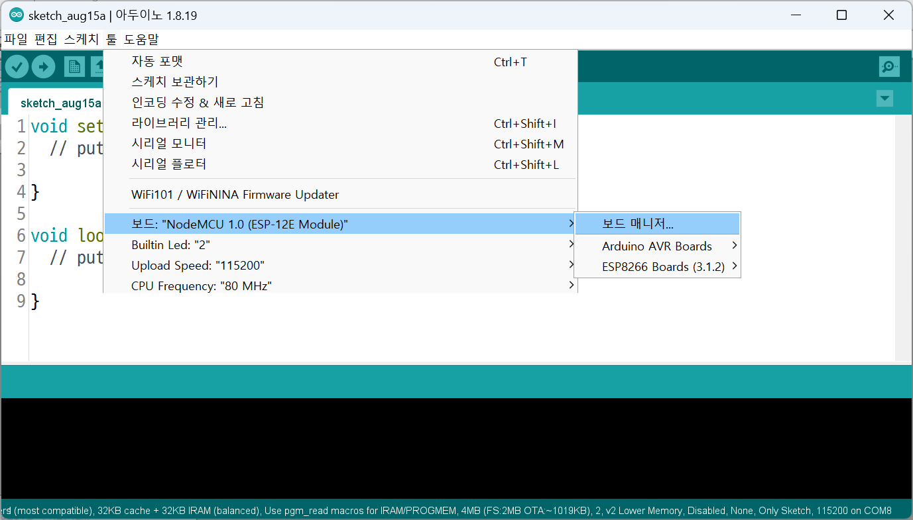


보드 매니저의 검색어 입력란에 `esp8266`을 입력하여 검색된 결과 중 ESP8266 Community 에서 제공한 패키지를 설치한다. 

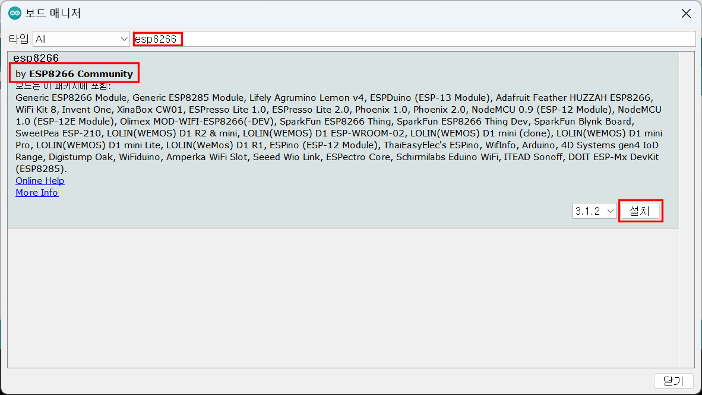

esp8266 보드 패키지가 설치되었으면, 툴 메뉴의 보드 항목을 ESP8266 `Boards(3.1.2)>` 의 `NodeMCU 1.0(ESP-12E Module)`로 설정한다. 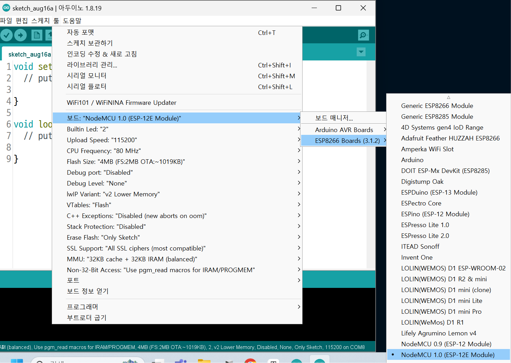

툴메뉴의 포트 설정을 위해 + `R`키를 눌러 실행 창에 `devmgmt.msc`를 입력하여 장치관리자를 실행한다. 

ESP 8266 보드를 USB포트에 연결할 때 장치관리자의 포트항목의 변화를 살핀다.

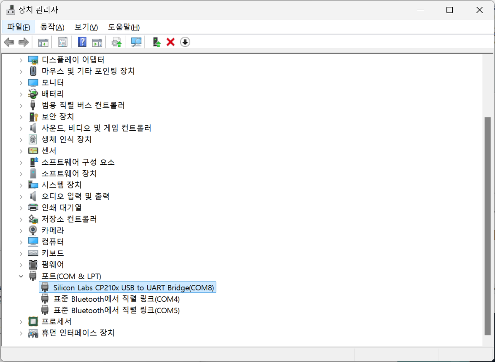

`SiliconLabs CP210x USB to UART Bridge(COM8)`이 나타난 것을 확인할 수 있다. 

툴 메뉴의 포트 항목을 위 경우에는 **COM8**로 설정한다.

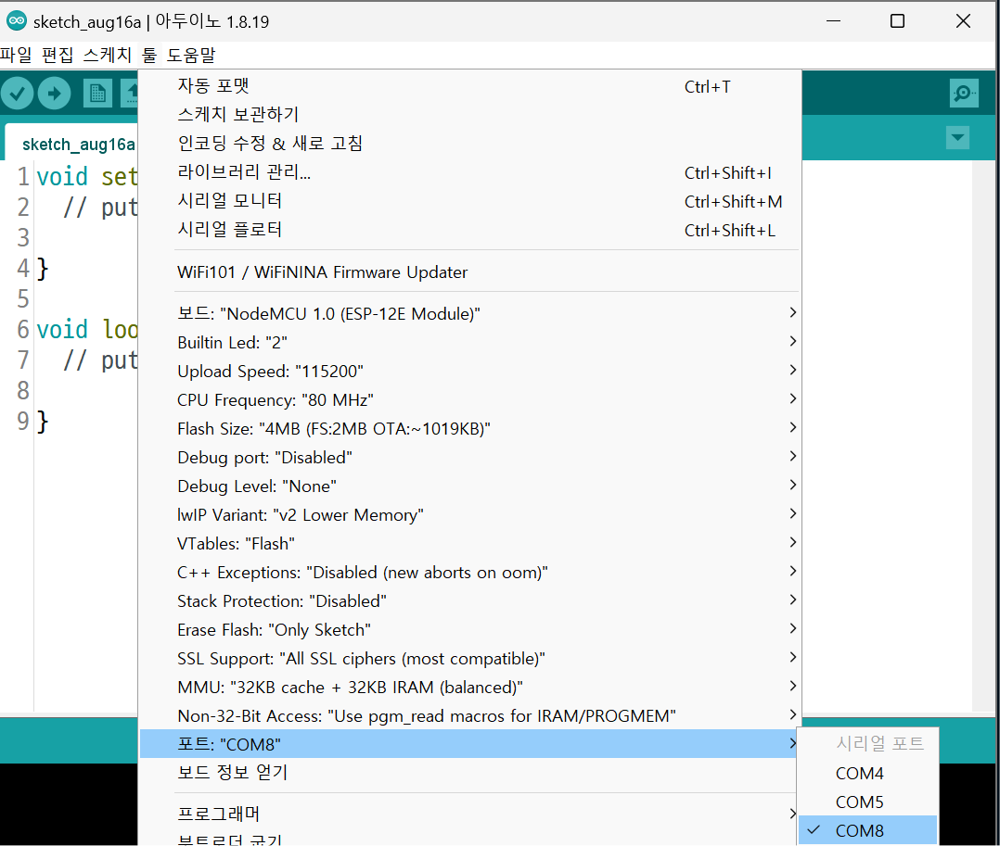

다음 예제를 작성한다. 

ESP8266Blink.ino

```c
/*
  ESP8266 Blink by Simon Peter
  Blink the blue LED on the ESP-12E module
  This example code is in the public domain

  The blue LED on the ESP-12E module is connected to GPIO2
  (which is also the TXD pin; so we cannot use Serial.print() at the same time)

  Note that this sketch uses LED_BUILTIN to find the pin with the internal LED
*/

#define LED_BUILTIN 2

void setup() {
  pinMode(LED_BUILTIN, OUTPUT);  // Initialize the LED_BUILTIN pin as an output
}

// the loop function runs over and over again forever
void loop() {
  digitalWrite(LED_BUILTIN, LOW);  // Turn the LED on (Note that LOW is the voltage level
  // but actually the LED is on; this is because
  // it is active low on the ESP-01)
  delay(1000);                      // Wait for a second
  digitalWrite(LED_BUILTIN, HIGH);  // Turn the LED off by making the voltage HIGH
  delay(2000);                      // Wait for two seconds (to demonstrate the active low LED)
}
```

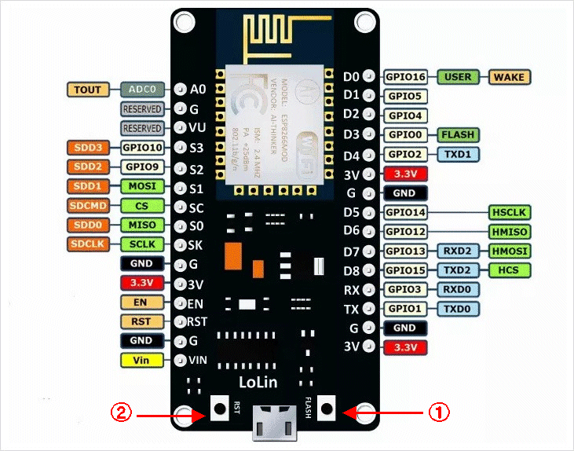

작성한 코드를 업로드하기 위해 위 그림에 ①로 표시한 `FLASH`버튼을 누른 채로 위 그림에 ②로 표시한 `RST`버튼을 란 번 누른 후 업로드 아이콘을 클릭한다. 

ESP8266 보드의 LED가 1초간격으로 점멸하는 것을 확인한다.

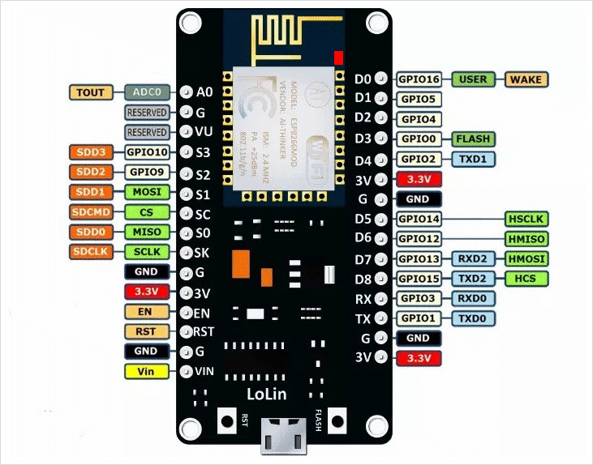

여기까지 확인 되었다면 아두이노 통합개발환경에서 ESP8266보드를 이용하기 위한 기본적인 설정은 완료된 것이다. 하지만 굳이 ESP8266 보드를 사용하려는 것은 WiFi를 이용하기 위해서 이므로 ESP8266 보드의  WiFi 기능 테스트를 위해 다음 예제를 업로드한다.

esp8266_WiFiWebServer.ino

```c
#include <ESP8266WiFi.h>

//*
const char* ssid = "KT_GiGA_2G_43E1";
const char* password = "6gb28gd078";
//*/
/*
const char* ssid = "S10e_Hotspot";
const char* password = "43698602";
*/


// Create an instance of the server
// specify the port to listen on as an argument
WiFiServer server(80);

void setup() {
  Serial.begin(115200);
  delay(10);

  // prepare GPIO2
  pinMode(2, OUTPUT);
  digitalWrite(2, 0);
  
  // Connect to WiFi network
  Serial.println();
  Serial.println();
  Serial.print("Connecting to ");
  Serial.println(ssid);
  
  WiFi.begin(ssid, password);
  
  while (WiFi.status() != WL_CONNECTED) {
    delay(500);
    Serial.print(".");
  }
  Serial.println("");
  Serial.println("WiFi connected");
  
  // Start the server
  server.begin();
  Serial.println("Server started");

  // Print the IP address
  Serial.println(WiFi.localIP());
}

void loop() {
  // Check if a client has connected
  WiFiClient client = server.available();
  if (!client) {
    return;
  }
  
  // Wait until the client sends some data
  Serial.println("new client");
  while(!client.available()){
    delay(1);
  }
  
  // Read the first line of the request
  String req = client.readStringUntil('\r');
  Serial.println(req);
  client.flush();
  
  // Match the request
  int val;
  if (req.indexOf("/gpio/0") != -1)
    val = 0;
  else if (req.indexOf("/gpio/1") != -1)
    val = 1;
  else {
    Serial.println("invalid request");
    client.stop();
    return;
  }

  // Set GPIO2 according to the request
  digitalWrite(2, val);
  
  client.flush();

  // Prepare the response
  String s = "HTTP/1.1 200 OK\r\nContent-Type: text/html\r\n\r\n<!DOCTYPE HTML>\r\n<html>\r\nGPIO is now ";
  s += (val)?"high":"low";
  s += "</html>\n";

  // Send the response to the client
  client.print(s);
  delay(1);
  Serial.println("Client disonnected");

  // The client will actually be disconnected 
  // when the function returns and 'client' object is detroyed
}
```

업로드가 완료되면 시리얼 모니터 아이콘  을 클릭하여시리얼모니터를연 후, Baud Rate를 115200으로 맞추고, ESP8266 보드의 `RST`버튼을 누르면 아래와 같은 메세지가 출력된다.

``` 
Connecting to S10e_Hotspot
.......
WiFi connected
Server started
192.168.178.109
```

출력된 메세지의 의미는 ESP8266 보드가 SSID가 `S10e_Hotspot`인 WiFi 네크워크에 연결되어 `192.168.178.109`라는 IP주소를 부여 받았다는 것이다.

이 때 PC(또는 스마트 폰 등)의 WiFi를 같은 SSID(위의 경우 `S10e_Hotspot`)에 연결후, 웹브라우저를 실행한다.

브라우저 주소창에`192.168.178.109/gpio/0`를 입력하면 ESP8266 보드의 LED가 켜지고,

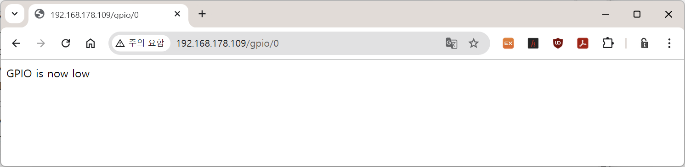

브라우저 주소창에`192.168.178.109/gpio/1`을 입력하면 ESP8266 보드의 LED가 꺼지는 것을 확인한다. 

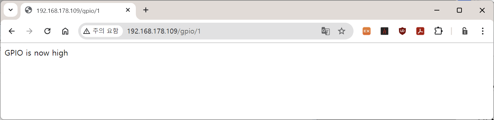


[목차](../README.md) 

