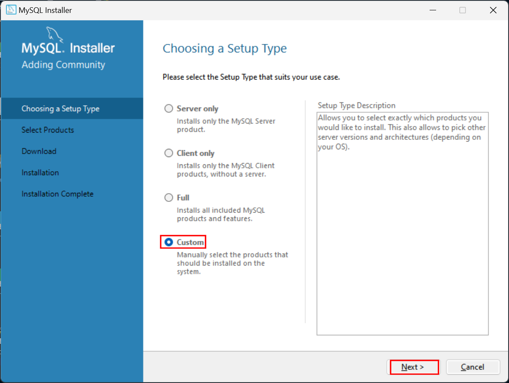
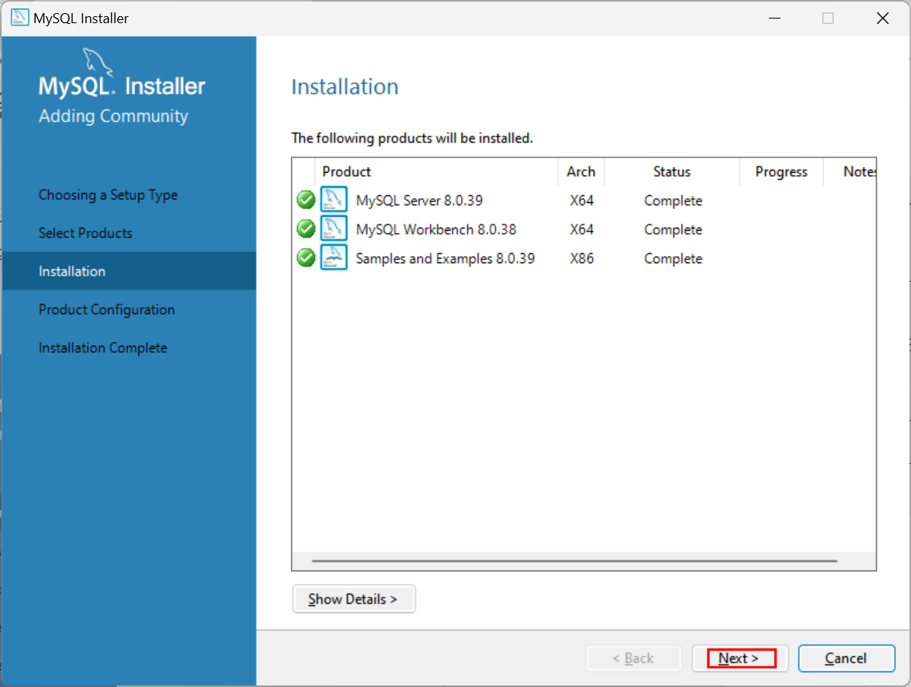

### 2. MySQL 설치 및 설정

---


#### 2.1. MySQL Community 8.0 설치

[**MySQL Community8.0 최신버전 다운로드**](https://dev.mysql.com/downloads/windows/installer/8.0.html)

위 다운로드 링크를 열면2가지 설치 파일이 제공되는데 그 중 303.6MB용량의 `mysql-installer-community-8.0.39.0.msi`파일을 다운로드 한다.


다운로드한  `mysql-installer-community-8.0.39.0.msi`파일을 더블클릭하여 설치를 시작한다.

Choosing Setup Type 단계에서 Custom을 선택 후 [Next] 버튼을 클릭한다.



Select Products 단계에서 **1/3** MySQL Server 8.0.39 - X64를 선택 후,  를 클릭하여 Products To Be Installed 영역에 `MySQL Server 8.0.39 - X64`가 표시되게 한다. 


같은 요령으로 **2/3** MySQLWorkbench 8.0.38 - X64를 선택 후,  를 클릭하여 Products To Be Installed 영역에 `MySQLWorkbench 8.0.38 - X64`가 표시되게 한다. 


역시 같은 요령으로 **3/3** Samples and Examples 8.0.39 - X86를 선택 후,  를 클릭하여 Products To Be Installed 영역에 `Samples and Examples 8.0.39 - X86`가 표시되게 한다. 


여기까지 진행했다면 Products To Be Installed 영역에 `MySQL Server 8.0.39 - X64`, `MySQLWorkbench 8.0.38 - X64`, `Samples and Examples 8.0.39 - X86`3가지가 표시되어 있는 것을 확인 했다면 [Next] 버튼을 클릭한다.


Installation에서는 전 단계에서 선택한 Product가 설치목록과 일치하는 지 확인 후 [Excute] 버튼을 클릭한다.


설치결과 화면의 Status 필드가 모든 Product에 대해서 Complete인 것을 확인 후, [Next] 버튼을 클릭한다. 



Product Configuration 화면에서Product 목록에서 `MySQL Server 8.0.39 - X64`, `Samples and Examples 8.0.39 - X86`를 확인 후, [Next] 버튼을 클릭한다.


Type and Networking 화면에서 Show Advanced and Logging Options에 체크하고, 나머지는 기본 설정을 유지한 채로 [Next] 버튼을 클릭한다. 


Authetification Method 화면에서는 Use Legcy Authentification Method( Retain MySQL 5.x Compatibility )를 선택 후, [Next] 버튼을 클릭한다. 


Accounts and Roles 화면에서 MySQL Root Password와 Repeat Password에 `1234`를, 입력 후, [Next] 버튼을 클릭한다. 


Windows Service 화면에서는 Windows Service에 `MySQL`을 입력 후, 나머지 설정은 기존값을 유지한 채로 [Next] 버튼을 클릭한다. 


Server File Permissions에서는 모든 선택을 기존값을 유지한 채로  [Next] 버튼을 클릭한다. 


Logging Options 역시 모든 선택을 기존값을 유지한 채로  [Next] 버튼을 클릭한다. 


Advanced Options 역시 모든 선택을 기존값을 유지한 채로  [Next] 버튼을 클릭한다. 


Apply Configuration 에서 지금까지의 설정을 적용하기 위해 [Excute] 버튼을 클릭한다. 


모든 Configuration Steps에 초록색 체크가 표시되고, The configuration for MySQL Server 8.0.39 was successful. 메세지를 확인 후, [Finish] 버튼을 클릭한다. 


Product Configuration의 Product에 MySQL Server 8.0.39의 Status가 Configuration complete인 것을 확이 후,  [Next] 버튼을 클릭한다. 


Connect To Server화면에서 Password에 `1234`를 입력 후, [Check] 버튼을 클릭한다. 


Status에 초록 바탕에 Connection Succeeded. 메세지 확인 후,  [Next] 버튼을 클릭한다. 


Apply Configuration에서  [Excute] 버튼을 클릭한다. 


모든 Configuration Steps에 초록색 체크가 표시되고, The configuration for Samples and Examples 8.0.39 was successful. 메세지를 확인 후, [Finish] 버튼을 클릭한다. 


Product Configuration 화면의 모든 Product의 Status가 Complete인 것을 확인 후, [Next] 버튼을 클릭한다. 


Start MySQL Workbench after setup의 체크를 해제하고  [Finish] 버튼을 클릭한다. 


#### 2.2. MySQL 설치 확인 및 원격 연결을 위한 사용자 추가

몇가지 확인 및 설정을 위해 시작 - 모든 앱 - MySQL - MySQL 8.0 Command Line Client를 실행한다.


```
Enter password: 
```

패스워드 `1234`를 입력한다. 

```sql
Enter password: ****
Welcome to the MySQL monitor.  Commands end with ; or \g.
Your MySQL connection id is 19
Server version: 8.0.39 MySQL Community Server - GPL

Copyright (c) 2000, 2024, Oracle and/or its affiliates.

Oracle is a registered trademark of Oracle Corporation and/or its
affiliates. Other names may be trademarks of their respective
owners.

Type 'help;' or '\h' for help. Type '\c' to clear the current input statement.

mysql>
```

사용 가능한 DB 목록을 출력하기 위해 다음 명령을 실행시켜 보자

```sql
mysql> show databases;
+--------------------+
| Database           |
+--------------------+
| information_schema |
| mysql              |
| performance_schema |
| sakila             |
| sys                |
| world              |
+--------------------+
6 rows in set (0.01 sec)

mysql>
```

작업 DB를 `mysql`로 변경하기 위해 다음 명령을 실행시켜 보자.

```sql
mysql> use mysql
Database changed
mysql>
```

`mysql` DB의 테이블 목록을 출력하기 위해 다음 명령을 실행시켜 보자.

```sql
mysql> show tables;
+------------------------------------------------------+
| Tables_in_mysql                                      |
+------------------------------------------------------+
| columns_priv                                         |
| component                                            |
| db                                                   |
| default_roles                                        |
| engine_cost                                          |
| func                                                 |
| general_log                                          |
| global_grants                                        |
| gtid_executed                                        |
| help_category                                        |
| help_keyword                                         |
| help_relation                                        |
| help_topic                                           |
| innodb_index_stats                                   |
| innodb_table_stats                                   |
| ndb_binlog_index                                     |
| password_history                                     |
| plugin                                               |
| procs_priv                                           |
| proxies_priv                                         |
| replication_asynchronous_connection_failover         |
| replication_asynchronous_connection_failover_managed |
| replication_group_configuration_version              |
| replication_group_member_actions                     |
| role_edges                                           |
| server_cost                                          |
| servers                                              |
| slave_master_info                                    |
| slave_relay_log_info                                 |
| slave_worker_info                                    |
| slow_log                                             |
| tables_priv                                          |
| time_zone                                            |
| time_zone_leap_second                                |
| time_zone_name                                       |
| time_zone_transition                                 |
| time_zone_transition_type                            |
| user                                                 |
+------------------------------------------------------+
38 rows in set (0.02 sec)
```

테이블 목록 중 현재 관심을 두고 있는 것은 `user`테이블이다. `user`테이블의 모든 레코드의 `user`필드와 `host` 필드 출력을 위해 다음 명령을 실행시켜 보자.

```
mysql> select user, host from user;
+------------------+-----------+
| user             | host      |
+------------------+-----------+
| mysql.infoschema | localhost |
| mysql.session    | localhost |
| mysql.sys        | localhost |
| root             | localhost |
+------------------+-----------+
4 rows in set (0.00 sec)

mysql>
```

`mysql` DB에 4개의 사용자 계정이 등록되어 있고, 모든 계정의 `host`가 `localhost`로 되어있다는 것을 알 수 있다. 여기에 문제가 있다. 모든 사용자가 `localhost`에서만 DB에 연결할 수 있다는 것인데, ESP8266 보드가 WiFi 네트워크로 원격 호스트에서 접속해야 하기 때문이다. 따라서 기존의 사용자의 `host`를 변경 하거나, 원격 `host`에서 DB에 연결이 가능한 사용자를 등록해 주어야 한다. 

어떤 `host`에서도 DB 연결이 가능한 사용자 `user1`을 등록하기 위해 다음 명령을 실행시켜 보자.

```sql
mysql> create user 'user1'@'%' identified by '1234';
Query OK, 0 rows affected (0.02 sec)

mysql>
```

`user`테이블의 모든 레코드의 `user`필드와 `host` 필드 출력을 위해 다음 명령을 다시 실행시켜 보자.

```
select user, host from user;
```

```sql
mysql> select user, host from user;
+------------------+-----------+
| user             | host      |
+------------------+-----------+
| user1            | %         |
| mysql.infoschema | localhost |
| mysql.session    | localhost |
| mysql.sys        | localhost |
| root             | localhost |
+------------------+-----------+
5 rows in set (0.00 sec)

mysql>
```

`host` 가 `%`인 사용자 `user1`이 추가된 것을 확인할 수 있다. `host` 가 `%`라는 것은 어떤 호스트에서도 DB에 연결할 수 있다는 의미이다. 즉 `user1`은 어떤 원격 `host`에서도 DBDb에 연결할 수 있는 사용자라는 의미입니다. 

`user1`사용자에게 모든 데이터베이스와 그 테이블들에 접근할 수 있는 권한을 부여하기위해 다음 명령을 실행하여 보자.

```
GRANT ALL ON *.* TO 'user1'@'%';
```

```sql
mysql> GRANT ALL ON *.* TO 'user1'@'%';
Query OK, 0 rows affected (0.01 sec)

mysql> 
```

MySQL 설치 시, MySQL을 `MySQL`이라는 윈도우 서비스로 만들어 등록하여컴퓨터가 구동될 때, 해당서비스가 실행되도록 하였다. 현재 실행 중인 `MySQL` 서비스는 `user1`사용자가 등록되지 않은 채로 구동 중이므로 해당 서비스를 재시작하여 추가된 사용자 `user1`의 정보를 반영해 주어야 한다.

윈도우 시작 버튼을 누르고 검색어 입력란에 `서비스`를 입력하여 검색된 을 실행한다. 


서비스 목록에서 `MySQL`을 찾아 재시작 시킨다.


#### 2.3. 스마트폰을 이용한 DB 원격 연결 테스트

스마트 폰의 `Play Store`를 실행 후, `hisql`을 검색하여 설치한다.


스마트폰의 WiFi연결을 MySQL이 설치된 PC가 연결되어 있는 WiFi네트워크에 연결한다.

`hisql`을 실행 한다.

MySQL이 설치된 PC의 IP주소를 알아내기 위해 아래 그림에 **①**, **②**로 표시된 곳을 순서대로 클릭한다. 


아래 그림에 표시한 **ⓘ**를 클릭한다. 


네트워크 및 인터넷 정보 창의 IPv4 주소 항목에서 IP 주소를 알 수 있다. 


`hisql`의 **연결들** 화면에서 [+]표시를 터치하여 **연결편집기**를 열고, **서버 호스트/IP**에 위에서 알아낸 IP주소( 이 경우 `172.16.0.7` )를 입력하고, **포트**는 기본값인 `3306`을 그대로 유지한다. **사용자이름**에는 앞서 원격 호스트에서의 연결을위해 생성한 사용자 `user1`을, **비밀번호**에는 user1의 패스워드 `1234`를 입력 후 지금까지 입력한 연결정보를 저장하기위해 를 터치한다.

저장된 연결 중 접속하고자 하는 연결의 표시를 터치 후, **연결하기**를 터치한다. 연결이 되면 아래 그림과 같이 DB 목록이 나타난다. 


[목차](../README.md) 
