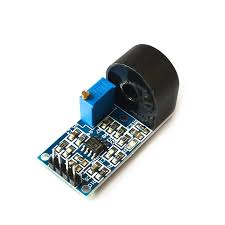

## 전력 절약을 위한 전력 측정 장치 개발

콘센트에 연결된 장치의 소비전력을 측정하여 데이터베이스에 기록하는 IoT 장치를 제작하고, 각 장치 별 전력 소비를 웹을 통해 모니터링 할 수 있는 기능 구현.

---

#### 주요 부품

컨트롤러: NodeMCU(ESP8266) 보드

전류센서: ZMCT103C

---

#### 목차

[**1. 아두이노 개발환경 설정**](./md/config_arduino_ide.md)

[**2. mysql 설치**](./md/install_mysql.md)

[**3. DB기반 소비전력 측정장치 제작**](./md/make_power_mesuring_device.md)

---

