### 3. 데이터베이스 기반 소비전력 측정 장치 제작

#### 3.1. 결선 및 조립

다음과 같이 ESP8266 보드와 ZMCT103C 전류센서 모듈 및 기타 자재를 연결한다.

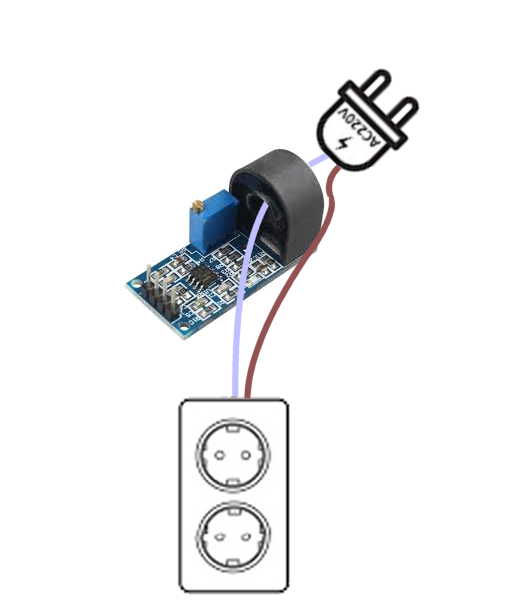

ZMCT103C 전류 센서와 ESP8266 보드의 결선은 다음과 같다.

| ZMCT103C | ESP8266 |
| -------- | ------- |
| VCC      | VIN     |
| GND      | GND     |
| OUT      | A0      |

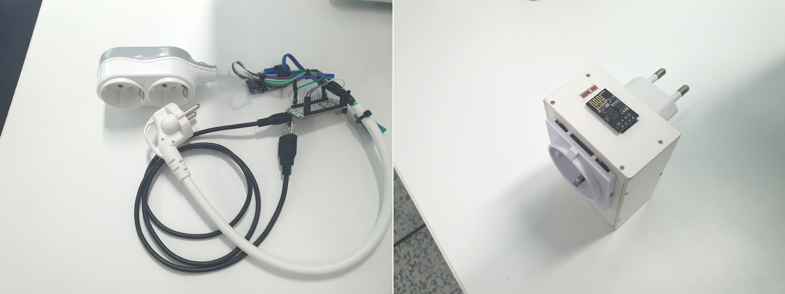

#### 3.2 전류 및 전력 측정 아두이노 코드 작성

`zmct103c_current.ino`

```c
/*
 *    ESP8266             ZMCT103C
 *    ----------------------------
 *        Vin ------------ Vcc
 *        GND ------------ GND
 *         A0 ------------ OUT
 *    ----------------------------
*/
int sensorPin = A0;            // ZMCT103C Out
float calibrationFactor = 0.050; // calibrationFactor (depend on sensor & circuit)

void setup() {
  Serial.begin(115200);
}

void loop() {
  float nVPP = getVPP();        // mesure Vp-p
  float current = nVPP * calibrationFactor; // calcurate current

  Serial.print("Vp-p: ");
  Serial.print(nVPP, 3);
  Serial.println("(V)");

  Serial.print("Current: ");
  Serial.print(current, 5);
  Serial.println("(A)");

  Serial.print("Power : ");
  float watt = current * 220;
  Serial.print(watt, 3);
  Serial.println("(W)");

  delay(1000); // mesure every second
}

/************************************ 
function for mesure Vp-p
*************************************/
float getVPP() {
  float result;
  int readValue;                // read from sensor
  int maxValue = 0;             // variable for maximum value
  int minValue = 1024;          // variable for minimum Value
  uint32_t start_time = millis();

  while((millis() - start_time) < 1000) {  // Sampling for 1(sec)
    readValue = analogRead(sensorPin);
    // update  maxValue
    if (readValue > maxValue) {
      maxValue = readValue;
    }
    // update  minValue
    if (readValue < minValue) {
      minValue = readValue;
    }
  }

  // calcurate Vp-p
  result = ((maxValue - minValue) * 5.0) / 1024.0;
  
  return result;
}
```

조립한 장치의 콘센트에 아래 그림과 같이 소비전력이 4(W)인 LED 전구를 연결하고 작성한 코드를 업로드한다.


시리얼모니터 실행 후 BAUDRATE를 115200으로 설정하면 다음과 같은 출력을 확인 할 수 있다.

```
Vp-p: 0.371(V)
Current: 0.01855(A)
Power : 4.082(W)
Vp-p: 0.371(V)
Current: 0.01855(A)
Power : 4.082(W)
Vp-p: 0.371(V)

```

#### 3.3. 전류센서 미세조정

이제 시리얼 모니터로 출력되는  `Power : 4.082(W)` 가 4(W)보다 작으면  ZMCT 전류센서 모듈의 미세 조정용 가변저항(아래 그림에 표시한)을 반시계 방향으로, 4(W)보다 크면 시계방향으로 돌려 소비전력 측정값이 4(W)에 최대한 근접하게 조정한다.

전력 = 전압 × 전류 = 220(V) × x(A) = 4(W) 이므로, 전류 = 4(W) ÷ 220(V) = 0.01818(A) 로 계산되는데, 위 시리얼 모니터의 출력을 보면 전류 측정값이 `0.01855`이므로 어느 정도 근사한 측정 결과가 나타난다는 것을 알 수 있다.


#### 3.4. 데이터베이스 준비

소비 전류 및 전력 측정 코드를 테스트 하였다. 이를 바탕으로 측정값을 데이터베이스에 주기적으로 기록하는 코드를 작성하기 위해 우선 앞서 [**2. mysql 설치**](./install_mysql.md) 과정에서 설치한 MySQL에 적절한 데이터 베이스와 테이블을 만들어 주기 위해 `MySQL 8.0 Command Line Client`를 실행한다. 

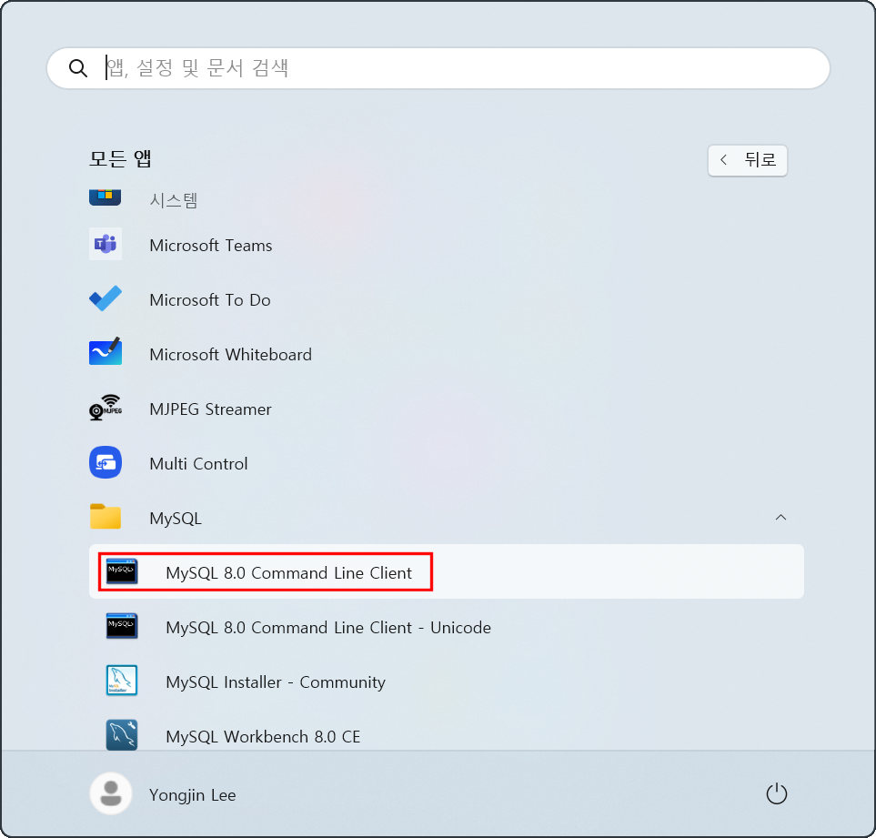

```sql
Enter password: 
```

패스워드 `1234`를 입력한다. 

```sql
Enter password: ****
Welcome to the MySQL monitor.  Commands end with ; or \g.
Your MySQL connection id is 19
Server version: 8.0.39 MySQL Community Server - GPL

Copyright (c) 2000, 2024, Oracle and/or its affiliates.

Oracle is a registered trademark of Oracle Corporation and/or its
affiliates. Other names may be trademarks of their respective
owners.

Type 'help;' or '\h' for help. Type '\c' to clear the current input statement.

mysql>
```

장치별 소비전력 기록을 위한 데이터베이스 `power`를 만들기 위해 다음 sql문을 실행한다.

```sql
create database power;
Query OK, 1 row affected (0.02 sec)

mysql>
```

데이터베이스 `power`가 생성되었는 지 확인을 위해 다음 sql문을 실행한다.

```sql
mysql> show databases;
+--------------------+
| Database           |
+--------------------+
| information_schema |
| mysql              |
| performance_schema |
| power              |
| sakila             |
| sys                |
| world              |
+--------------------+
8 rows in set (0.00 sec)

mysql>
```

생성된 DB `power`에 소비전력을 측정하고자 하는 `장치1`의 소비전력 기록을 위한 테이블 `dev01`생성하려면 해당 데이터베이스가 선택(지정)되어 있어야 한다. `power` 데이터베이스를 선택(지정)하기 위해 다음 sql문을 실행한다.

```sql
mysql> use power;
Database changed
mysql>
```

선택(지정)한 DB `power`가 가지고 있는 table들을 확인하기 위해 다음 sql문을 실행한다.

```sql
mysql> use power;
Database changed
mysql> show tables;
Empty set (0.00 sec)

mysql>
```

당연하게도 등록된 테이블이 없으므로, 아무것도 출력 되지 않는다. 다음 명령을 실행하여 소비전력을 측정 하려는 `장치1`의 소비전력 기록을 위한 테이블 `dev01`생성한다. 

```sql
mysql> create table dev01(Id int not null auto_increment primary key, Ampere float not null,Power float not null,Time timestamp default CURRENT_TIMESTAMP);
Query OK, 0 rows affected (0.03 sec)

mysql>
```

다음 명령을 실행하여 테이블 `dev01`의 생성 여부를 확인한다.

```sql
mysql> show tables;
+-----------------+
| Tables_in_power |
+-----------------+
| dev01           |
+----------------+
1 row in set (0.00 sec)

mysql>
```

#### 3.4. 측정값을 DB에 insert하는 아두이노 코드 작성 및 테스트

Arduino IDE를 실행 후, 스케치 메뉴의 `라이브러리 포함하기`에서 `라이브러리 관리... Ctrl+Shift+I`를 실행한다.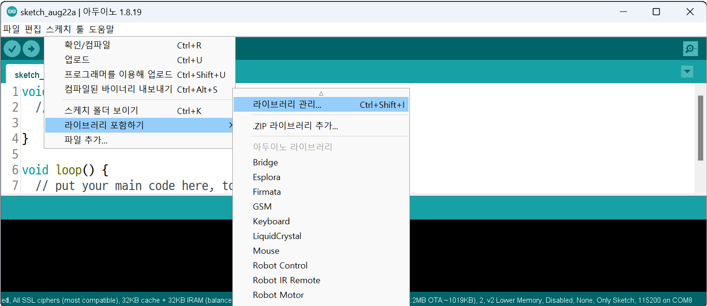

라이브러리 매니저에서 토픽에 `mysql`을 입력하여 검색된 라이브러리들 중 `MySQL Connector Arduino`를 설치한다.


`MySQL Connector Arduino`라이브러리는 버그가 존재한다. `ESP-12E`모듈을 사용하는 NodeMCU보드에서 사용할 경우 문제를 일으키는데, 이를 해결하기 위해 라이브러리 소스코드를 수정해 주어야 한다.

윈도우 파일탐색기에서 문서의 Arduino 폴더를 연다.

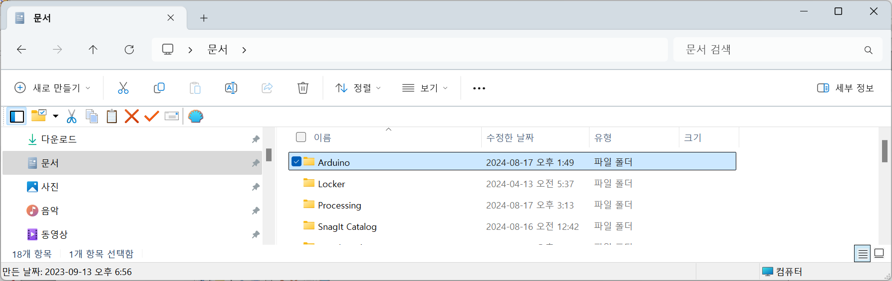

 Arduino 폴더의 libraries폴더를 연다.

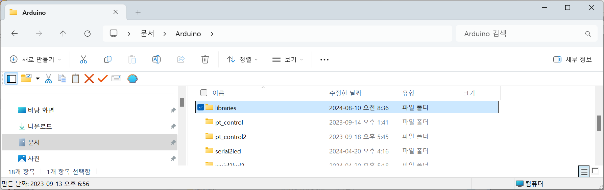

Arduino 폴더의 libraries폴더의 MySQL_Connector_Arduino폴더를 연다.


Arduino 폴더의 libraries폴더의 MySQL_Connector_Arduino폴더의 src를 연다.

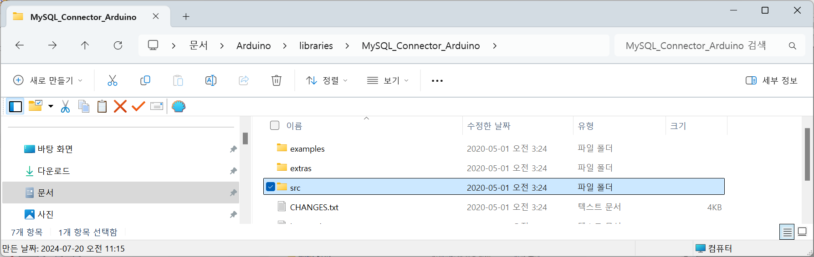

Arduino 폴더의 libraries폴더의 MySQL_Connector_Arduino폴더의 MySQL_Encrypt_Sha1.cpp 파일을 찾아 적당한 문서 편집기로 연다.

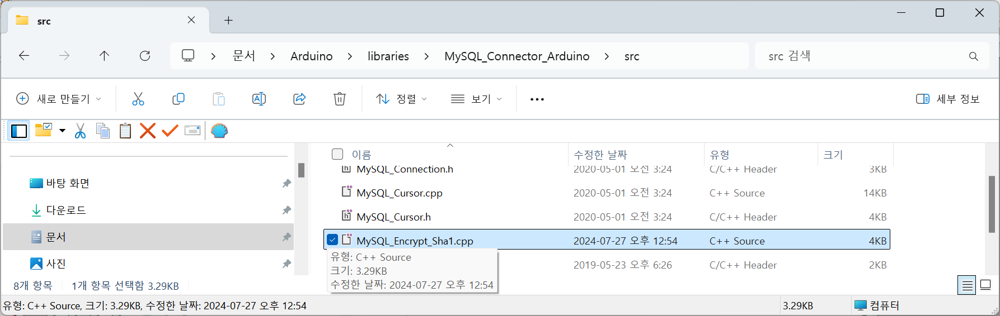

86행 부근의 `size_t Encrypt_SHA1::write()`함수 정의 부분을 찾아 다음과 같이 `return`문을 추가해 준다.

```c++
size_t Encrypt_SHA1::write(uint8_t data) {
  ++byteCount;
  addUncounted(data);
  return 1;
}
```

그 다음의 `size_t Encrypt_SHA1::write()`함수 정의 부분에도 다음과 같이 `return`문을 추가해 준다.

```c++
size_t Encrypt_SHA1::write(uint8_t* data, int length) {
  for (int i=0; i<length; i++) {
    write(data[i]);
  }
  return 1;
}
```

수정된 `MySQL_Encrypt_Sha1.cpp`파일을 저장 하고, 편집 프로그램을 종료한다.

Arduino IDE를 실행하고, 한 시간 마다 소비전류와 소비전력을 측정하여 DB `power`의 `dev01`테이블에 기록하는 다음 아두이노 코드를 작성하여,  ESP8266 보드에 업로드한다.

`basic_insert_esp8266_zmct103.ino`

```c
/*
 *    ESP8266             ZMCT103C
 *    ----------------------------
 *        Vin ------------ Vcc
 *        GND ------------ GND
 *         A0 ------------ OUT
 *    ----------------------------
/*
  MySQL Connector/Arduino Example : connect by wifi

  This example demonstrates how to connect to a MySQL server from an
  Arduino using an Arduino-compatible Wifi shield. Note that "compatible"
  means it must conform to the Ethernet class library or be a derivative
  with the same classes and methods.
  
  For more information and documentation, visit the wiki:
  https://github.com/ChuckBell/MySQL_Connector_Arduino/wiki.

  INSTRUCTIONS FOR USE

  1) Change the address of the server to the IP address of the MySQL server
  2) Change the user and password to a valid MySQL user and password
  3) Change the SSID and pass to match your WiFi network
  4) Connect a USB cable to your Arduino
  5) Select the correct board and port
  6) Compile and upload the sketch to your Arduino
  7) Once uploaded, open Serial Monitor (use 115200 speed) and observe

  If you do not see messages indicating you have a connection, refer to the
  manual for troubleshooting tips. The most common issues are the server is
  not accessible from the network or the user name and password is incorrect.

  Created by: Dr. Charles A. Bell
*/
#include <ESP8266WiFi.h>           // Use this for WiFi instead of Ethernet.h
#include <MySQL_Connection.h>
#include <MySQL_Cursor.h>
IPAddress server_addr( 172,30,1,79);  // IP of the MySQL *server* here
char user[] = "user1";              // MySQL user login username
char password[] = "1234";        // MySQL user login password


// Sample query
char INSERT_SQL[] = "INSERT INTO power.dev01(Ampere, Watt) VALUES (%f, %f)";
char query[128];

// WiFi card example
//*
char ssid[] = "KT_GiGA_2G_43E1";         // your SSID
char pass[] = "6gb28gd078";     // your SSID Password
//*/

WiFiClient client;                 // Use this for WiFi instead of EthernetClient
MySQL_Connection conn(&client);
MySQL_Cursor* cursor;

int sensorPin = A0;            // ZMCT103C Out
float calibrationFactor = 0.050; // calibrationFactor (depend on sensor & circuit)
void setup(){
  Serial.begin(115200);
  while (!Serial); // wait for serial port to connect. Needed for Leonardo only

  // Begin WiFi section
  Serial.printf("\nConnecting to %s", ssid);
  WiFi.begin(ssid, pass);
  while (WiFi.status() != WL_CONNECTED) {
    delay(500);
    Serial.print(".");
  }

  // print out info about the connection:
  Serial.println("\nConnected to network");
  Serial.print("My IP address is: ");
  Serial.println(WiFi.localIP());

  Serial.print("Connecting to SQL...  ");
  if (conn.connect(server_addr, 3306, user, password))
    Serial.println("OK.");
  else
    Serial.println("FAILED.");
  
  // create MySQL cursor object
  cursor = new MySQL_Cursor(&conn);
}

void loop()
{
  float nVPP = getVPP();        // mesure Vp-p
  
  float Ampere = nVPP * calibrationFactor; // calcurate current
  float Watt = Ampere * 220; // calcurate power
  Serial.print("Vp-p: ");
  Serial.print(nVPP, 3);
  Serial.println("(V)");

  Serial.print("Current: ");
  Serial.print(Ampere, 5);
  Serial.println("(A)");

  Serial.print("Power : ");
  Serial.print(Watt, 3);
  Serial.println("(W)");

  delay(1000);
  sprintf(query, INSERT_SQL, Ampere, Watt);
    
  if (conn.connected())
    cursor->execute(query);

  delay(3600000); // every 1hour
}

float getVPP() {
  float result;
  int readValue;                // read from sensor
  int maxValue = 0;             // variable for maximum value
  int minValue = 1024;          // variable for minimum Value
  uint32_t start_time = millis();

  while((millis() - start_time) < 1000) {  // Sampling for 1(sec)
    readValue = analogRead(sensorPin);
    // update  maxValue
    if (readValue > maxValue) {
      maxValue = readValue;
    }
    // update  minValue
    if (readValue < minValue) {
      minValue = readValue;
    }
  }

  // calcurate Vp-p
  result = ((maxValue - minValue) * 5.0) / 1024.0;
  
  return result;
}
```

업로드가 완료되면 시리얼모니터를 열고 BAUDRATE를 115200으로 설정한다.

```
....
Connected to network
My IP address is: 172.30.1.108

```

ESP 8266 보드가 WiFi에 연결되어 `172.30.1.108`라는 IP주소를 부여 받았다는 것을 알 수 있다.

```
Connecting to SQL...  ...trying...
Connected to server version 172.30.1.79
OK.
Vp-p: 0.020(V)
Current: 0.00098(A)
Power : 0.215(W)

```

SQL 서버 연결에 성공했다는 것을 알 수 있다.

`MySQL 8.0 Command Line Client`를 실행하여 다음 SQL문을 실행하여 `power`데이터베이스의 `dev01`테이블에 기록된 레코드를 확인해 보자.

```sql
mysql> select * from power.dev01;
+----+----------+----------+---------------------+
| Id | Ampere   | Watt     | Time                |
+----+----------+----------+---------------------+
|  1 | 0.016846 |  3.70605 | 2024-08-17 14:37:10 |
|  2 | 0.016357 |  3.59863 | 2024-08-17 14:37:17 |
|  3 | 0.019043 |  4.18945 | 2024-08-17 14:37:24 |
|  4 | 0.018311 |  4.02832 | 2024-08-17 14:37:31 |
|  5 | 0.018555 |  4.08203 | 2024-08-17 14:37:38 |
|  6 | 0.018555 |  4.08203 | 2024-08-17 14:37:45 |
|  7 | 0.019043 |  4.18945 | 2024-08-17 14:37:52 |
|  8 | 0.019287 |  4.24316 | 2024-08-17 14:38:00 |
|  9 | 0.016357 |  3.59863 | 2024-08-17 14:38:07 |
| 10 | 0.016357 |  3.59863 | 2024-08-17 14:38:14 |
| 11 | 0.018555 |  4.08203 | 2024-08-17 14:38:21 |
| 12 | 0.018555 |  4.08203 | 2024-08-17 14:38:28 |
+----+----------+----------+---------------------+
12 rows in set (0.00 sec)

mysql>
```

#### 3.5. `power`DB를 조회, 편집, 삽입,  삭제할 수 있는 웹앱 작성

`Node.js Command Prompt`를 실행 후, 

`express.js`로 `node.js` 웹어플리케이션 `power`를 작성하기 위해 다음 명령을 실행한다. 

```cmd
C:\Users\user>express power --ejs

  warning: option `--ejs' has been renamed to `--view=ejs'


   create : power\
   create : power\public\
   create : power\public\javascripts\
   create : power\public\images\
   create : power\public\stylesheets\
   create : power\public\stylesheets\style.css
   create : power\routes\
   create : power\routes\index.js
   create : power\routes\users.js
   create : power\views\
   create : power\views\error.ejs
   create : power\views\index.ejs
   create : power\app.js
   create : power\package.json
   create : power\bin\
   create : power\bin\www

   change directory:
     > cd power

   install dependencies:
     > npm install
```

새로 생성된 웹 어플리케이션 폴더 `power`로 경로 변경을 위해 다음 명령을 실행한다. 

```cmd
C:\Users\user>cd power
C:\Users\user\power>
```

웹 게시를 위한 기본 의존성 설치를 위해 다음 명령을 실행한다. 

```cmd
C:\Users\user\power>npm install

added 64 packages, and audited 65 packages in 687ms

12 packages are looking for funding
  run `npm fund` for details

found 0 vulnerabilities
npm notice
npm notice New major version of npm available! 9.6.7 -> 10.8.2
npm notice Changelog: https://github.com/npm/cli/releases/tag/v10.8.2
npm notice Run npm install -g npm@10.8.2 to update!
npm notice

C:\Users\user\power>
```

DB연결 및 데이터 삽입 등의 처리를 위한 추가 의존성 `mysql`설치를 위해 다음 명령을 실행한다. 

```cmd
C:\Users\user\power>npm install mysql

added 12 packages, and audited 77 packages in 1s

12 packages are looking for funding
  run `npm fund` for details

found 0 vulnerabilities

C:\Users\user\power>
```


`C:\Users\user\power\app.js` 편집

```javascript
var fs = require('fs');
var ejs = require('ejs');
var http = require('http');
var mysql = require('mysql');

var express = require('express');
var path = require('path');
var logger = require('morgan');
var cookieParser = require('cookie-parser');
var bodyParser = require('body-parser');

var routes = require('./routes/index');
var users = require('./routes/users');

var app = express();  

// connect database
var mySqlClient = mysql.createConnection({
	user:'user1',
	password:'1234',
	database:'power'
});

// generate & excute express web server
var app = express();
http.createServer(app).listen(8000,function(){
	console.log('Server running at http://127.0.0.1:8000');
});

// http://localhost:8000/ ---- list.html
app.get('/',function(req,res)
{
	fs.readFile('list.html','utf8',function(error,data)
	{
		if(error)
		{
			console.log('readFile Error');
		}
		else
		{
			mySqlClient.query('select * from dev01', function(error,results)
			{
				if(error)
				{
					console.log('error: ', error.message);
				}
				else
				{
					res.send(ejs.render(data,{ power:results }));
				}
			});
		}
	})
});

// http://locakhost:8000/insert ------ insert.html 
app.get('/insert',function(req,res)
{
	fs.readFile('insert.html','utf8',function(error,data)
	{
		if(error)
		{
			console.log('read file error');
		}
		else
		{
			res.send(data);
		}
	})
});

// http://locakhost:8000/edit/3 ---- edit.html
app.get('/edit/:id',function(req,res)
{
	fs.readFile('edit.html','utf8',function(error,data)
	{
		mySqlClient.query('select * from dev01 where id = ?',
		[req.params.id], function(error,result)
		{
			if(error)
			{
				console.log('read file error');
			}
			else
			{
				res.send(ejs.render(data,{ dev01:result[0] }));
			}
		});
	});
});

// http://localhost:8000/delete/3 
app.get('/delete/:id',function(req,res)
{
	mySqlClient.query('delete from dev01 where id = ?',
	[req.params.id],function(error,result)
	{
		if(error)
		{
			console.log('delete error');
		}
		else
		{
			console.log('delete id = %d',req.params.id);
			res.redirect('/');	// return main
		}
	});
});

// handle parameter transfered by POST method
app.use(bodyParser.urlencoded({ extended: true }));

app.post( '/insert', function(req, res)
{
	var body = req.body;
	
	mySqlClient.query( 'insert into dev01(Ampere, Watt) values(?,?)',
	[body.Ampere, body.Watt],function(error,result)
	{
		if(error)
		{
			console.log('insert error: ', error.message);
		}
		else
		{
			res.redirect('/');
		}
	});
});

app.post( '/edit/:id', function(req, res)
{
	var body = req.body;
	
	mySqlClient.query( 'update dev01 set Ampere=?, Watt=? where id=?',
	[body.Temperature,body.Humidity,body.id],function(error,result)
	{
		if(error)
		{
			console.log('update error: ', error.message);
		}
		else
		{
			res.redirect('/');
		}
	});
});
		
// view engine setup
app.set('views', path.join(__dirname, 'views'));
app.set('view engine', 'ejs');

// uncomment after placing your favicon in /public
//app.use(favicon(path.join(__dirname, 'public', 'favicon.ico')));
app.use(logger('dev'));
app.use(bodyParser.json());
app.use(bodyParser.urlencoded({ extended: false }));
app.use(cookieParser());
app.use(express.static(path.join(__dirname, 'public')));

app.use('/', routes);
app.use('/users', users);

// catch 404 and forward to error handler
app.use(function(req, res, next) {
  var err = new Error('Not Found');
  err.status = 404;
  next(err);
});

// error handlers

// development error handler
// will print stacktrace
if (app.get('env') === 'development') {
  app.use(function(err, req, res, next) {
    res.status(err.status || 500);
    res.render('error', {
      message: err.message,
      error: err
    });
  });
}

// production error handler
// no stacktraces leaked to user
app.use(function(err, req, res, next) {
  res.status(err.status || 500);
  res.render('error', {
    message: err.message,
    error: {}
  });
});


module.exports = app;
```


`C:\Users\user\power\list.html` 편집

```html
<!DOCTYPE html>
<html>

<head>
	<title>List Page</title>
</head>

<body>
	<h2>List Page</h2>
	<a href='/insert'>Insert Data</a>
	<hr/>
	<table>
		<tr>
			<th>DELETE</th>
			<th>EDIT</th>
			<th>ID</th>
			<th>Current</th>
			<th>Power</th>
			<th>Time</th>
		</tr>
	<% power.forEach(function(item,index){ %>
		<tr>
			<td><a href='/delete/<%=item.id %>'>DELETE</a></td>
			<td><a href='/edit/<%=item.id %>'>EDIT</a></td>
			<td><%=item.id %></td>
			<td align="center"><%=item.Ampere %></td>
			<td align="center"><%=item.Watt %></td>
			<td><%=item.time %></td>
		</tr>
	<% }); %>
	</table>
</body>

</html>
```


`C:\Users\user\power\edit.html` 편집

```html
<html>
<head></head>
<body>
<form method='post'>
	<fieldset>
		<legend>EDIT DATA</legend>
		
		<table>
			<tr>
				<td><lable>Id</lable></td>
				<td><input type="text" name="id" value="<%=dev01.id %>" disable /></td>
			</tr>
			<tr>
				<td><lable>Current</lable></td>
				<td><input type="text" name="Current" value="<%=dev01.Ampere %>" disable /></td>
			</tr>
			<tr>
				<td><lable>Power</lable></td>
				<td><input type="text" name="Power" value="<%=dev01.Watt %>" disable /></td>
			</tr>
		</table>
		<input type="submit" value="Update"/>
	</fieldset>
</form>
</body>
</html>
```


`C:\Users\user\power\insert.html` 편집

```html
<html>
<head></head>
<body>
<form method='post'>
	<fieldset>
		<legend>INSERT DATA</legend>
		
		<table>
			<tr>
				<td><lable>Current</lable></td>
				<td><input type="text" name="Ampere" value="" disable /></td>
			</tr>
			<tr>
				<td><lable>Power</lable></td>
				<td><input type="text" name="Watt" value="" disable /></td>
			</tr>
		</table>
		<input type="submit" value="Insert"/>
	</fieldset>
</form>
</body>
</html>
```


`C:\Users\user\power\delete.html` 편집

```html
<html>


<head>

</head>

<body>
	<form method='post'>
		<fieldset>
			<legend>DELETE DATA</legend>
			<table>
				<tr>
					<td><lable>id</lable></td>
					<td><input type="text" name="id" value="<%=power.id %>" disable /></td>
				</tr>
				<tr>
					<td><lable>Name</lable></td>
					<td><input type="text" name="name" value="<%=power.Ampere %>" disable /></td>
				</tr>
				<tr>
					<td><lable>Model Number</lable></td>
					<td><input type="text" name="modelnumber" value="<%=power.Watt %>" disable /></td>
				</tr>
				<tr>
					<td><lable>Series</lable></td>
			</table>
			<input type="submit" value="Delete"/>
		</fieldset>
	
</form>

</body>

</html>
```


`Node.js Command Prompt`를 실행 후, 작업 경로를 `C:\Users\user\power\`로 변경한다.

```cmd
C:\Users\user\power\>cd power
C:\Users\user\power\power>
```

웹 어플리케이션 `power`를 구동한다.

```cmd
C:\Users\user\power\power>node app.js
Server running at http://127.0.0.1:8000
```

웹브라우저를 열어 URL `localhost:3000`을 연다.

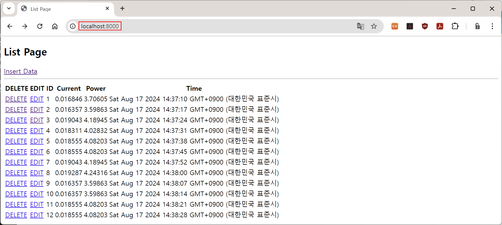


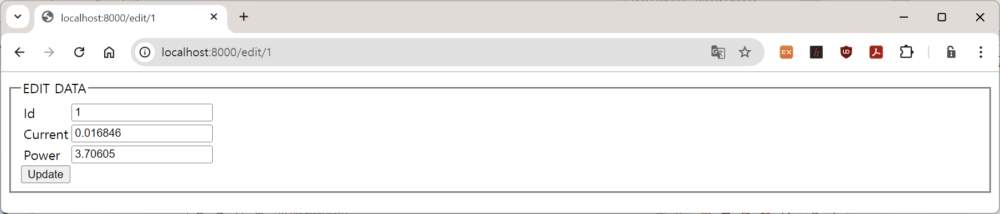


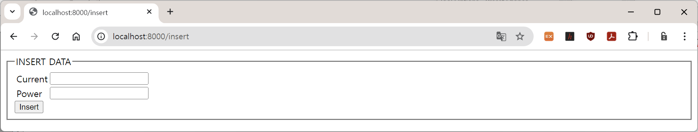


[목차](../README.md) 
